<div align="center">

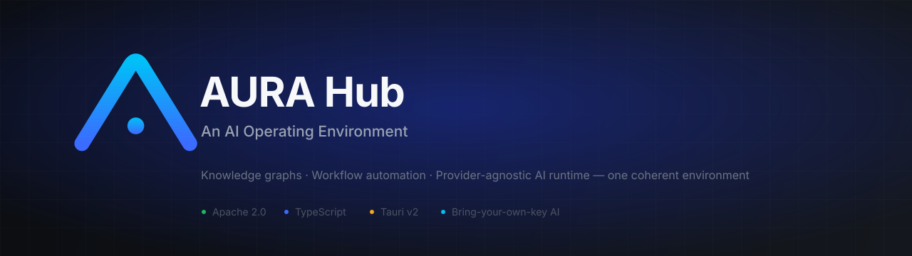

**An AI-native desktop engineering environment** — not a chat app, not a browser tab, not an editor plugin.

[](https://github.com/Aura-hub-ai-native-workspace/aura-hub/actions/workflows/ci.yml)
[](LICENSE)
[](#get-aura-hub)
[](https://tauri.app)
[](CONTRIBUTING.md)

[Website](https://claude.ai/code/artifact/8f4a92d5-f946-4b4a-a46e-eb10fe5e33f6) · [Get AURA Hub](#get-aura-hub) · [Quick Start](#quick-start) · [Features](#core-features) · [Screenshots](#product-screenshots) · [Demo](#demo) · [Architecture](#product-architecture) · [Development](#development) · [Roadmap](ROADMAP.md)

</div>

---

## What is AURA Hub?

Most developer tools give you an editor with an AI panel bolted onto the
side. Ask it something, and it re-derives context from whatever's
currently visible in the buffer — it doesn't know your architecture, it
doesn't remember yesterday's decisions, and every session starts from
zero. The chat window is a guest in someone else's house.

AURA Hub inverts that relationship: **the environment is the product.**
A project opened in AURA gets a persistent, structural understanding of
itself — a knowledge graph built from real static analysis, not a
best-effort text search — before any model is ever called. Engineering
work (multi-step missions, workflow automation, architecture review,
governance) runs as first-class, resumable, inspectable processes, not
one-shot chat completions. And the AI itself is never locked to one
vendor: AURA has no built-in model and no hidden API account — you bring
your own key to whichever provider you trust, and the entire platform,
every feature, works identically regardless of which one you pick.

## Why AURA Hub?

- **Grounded, not guessed.** Every AI answer is built on a real,
  incrementally-updated knowledge graph and system model — entities,
  relations, layers, health scores — computed once and queried, never
  reconstructed from a raw file dump on every keystroke.
- **Deterministic where it can be, probabilistic only where it must be.**
  Questions with one checkable answer (is this actually dead code, did
  this diff remove a public export) are answered by real parsing and
  arithmetic. The model's job is narrowed to what only a model can do:
  explain a cause in prose, draft a plausible patch.
- **No vendor lock-in.** Eleven AI providers are supported today through
  one shared adapter interface. Switching providers — or model, mid
  conversation — is a first-class, validated operation, never a
  reconfiguration.
- **Engineering memory that compounds.** Decisions, patterns, and
  learnings persist across sessions and inform future answers, instead
  of every conversation starting over.
- **Built for scale from day one.** A strict, inward-only architecture,
  a design system with zero raw hex values, and internals explicitly
  designed to support years of development rather than a demo. See the
  [Development Guide](docs/DEVELOPMENT.md) for the technical deep dive.

## Core Features

| Feature | What it is |
|---|---|
| 🪟 **Workspace / Window Manager** | A floating-window "second desktop" inside the app — dock, float, tile, and switch between panels (AI Chat, Files, Architecture, Knowledge, Missions, and more) instead of one fixed layout. |
| 🧭 **Mission Control** | Plans and executes multi-step engineering work as a real dependency-aware DAG — auto-ordered task waves, blocked/queued/running states, a critical-path view, and a full replay timeline. Every task still requires explicit human approval before it runs, and every proposal requires explicit **Accept** before anything is written. |
| 🤖 **AI Workflow Builder** | Describe an automation in plain language; AURA generates a real, validated, runnable node graph against the platform's actual node registry — never an invented node type, never a half-broken graph. |
| ⚙️ **Automation Studio** | A visual, node-based workflow engine with 10 real starter templates (code review, security audit, bug investigation, release notes, and more — see [`examples/`](examples/)) plus an event-driven automation layer that reacts to real platform moments (mission completed, PR merged, dependency changed). |
| 🧠 **Knowledge Graph** | AST-based static analysis (`graphify`) builds a real knowledge graph of your codebase — god-node detection, community structure, cross-file relationship queries — incrementally updated, not re-scanned from scratch. |
| 🏗️ **Architecture Blueprint** | A layered, structural view of the system — modules, dependencies, boundaries — distinct from the raw code graph, built from the same real analysis. |
| 🧩 **Engineering Intelligence** | The umbrella layer tying knowledge, governance, and prediction together: health scoring, architecture drift detection, technical debt tracking, and deterministic risk prediction — all evidence-based, zero fabricated metrics. |
| 💾 **Engineering Memory** | A persistent, queryable memory of engineering decisions, patterns, and learnings — grounded in real project history, so the platform gains experience instead of re-deriving everything every session. |
| 🔌 **Multi-Provider AI** | Eleven BYOAK (bring-your-own-key) providers behind one shared adapter interface — OpenAI, Anthropic, Gemini, Groq, Mistral, Cerebras, Kimi, NVIDIA, OpenRouter, Novita, and Qwen. Adding a provider is a small, self-contained adapter, not a rewrite. |

<details>
<summary><strong>How these fit together</strong> (click to expand)</summary>

<br>

Nothing above is a separate product bolted on. **Every** AI-backed
feature — chat, Ctrl+I inline actions, the Workflow Builder, Mission
Control, Diagnosis — funnels through the same shared engine underneath,
which means provider validation, error translation, retry/timeout
handling, and context assembly are implemented **once** and apply
**everywhere**, automatically, including to features built after this
sentence was written.

</details>

## Product Screenshots

> 📸 Real, live captures of the running app against this repository —
> not mockups. One slot (Mission Execution DAG) is still pending; see
> [`docs/assets/screenshots/SCREENSHOT_GUIDE.md`](docs/assets/screenshots/SCREENSHOT_GUIDE.md)
> for the exact capture spec and an honest note on two substituted shots.

| | |
|---|---|
|  **Application Shell & Home**<br>The full environment on first launch — navigation, command bar, and the project list. | 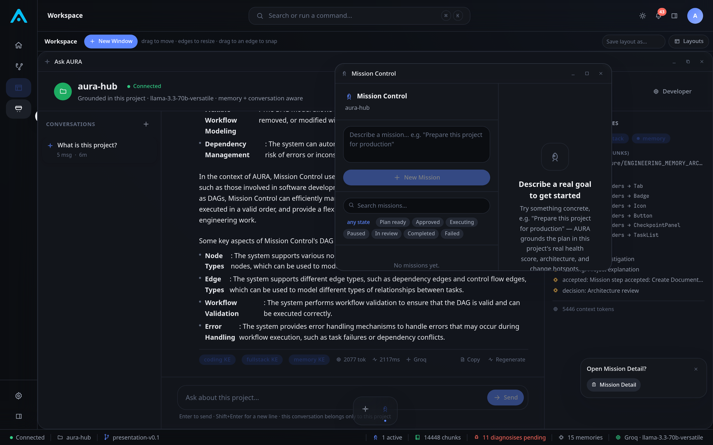 **Window Manager**<br>Floating panels — AI Chat, Mission Control — tiled together inside one project workspace. |
| 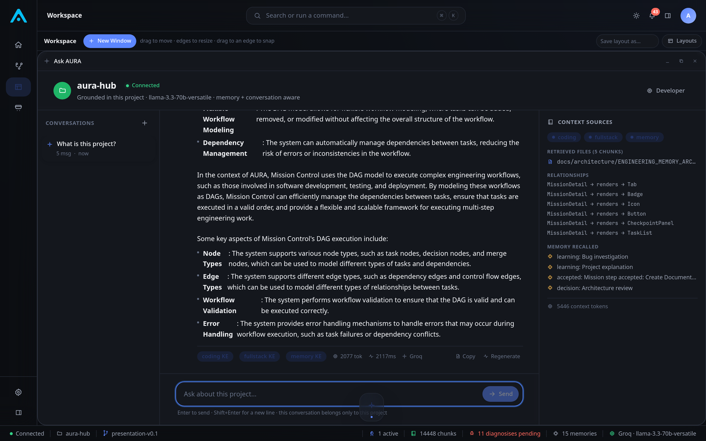 **AI Chat**<br>A grounded conversation, showing which knowledge engines and provider were used. | 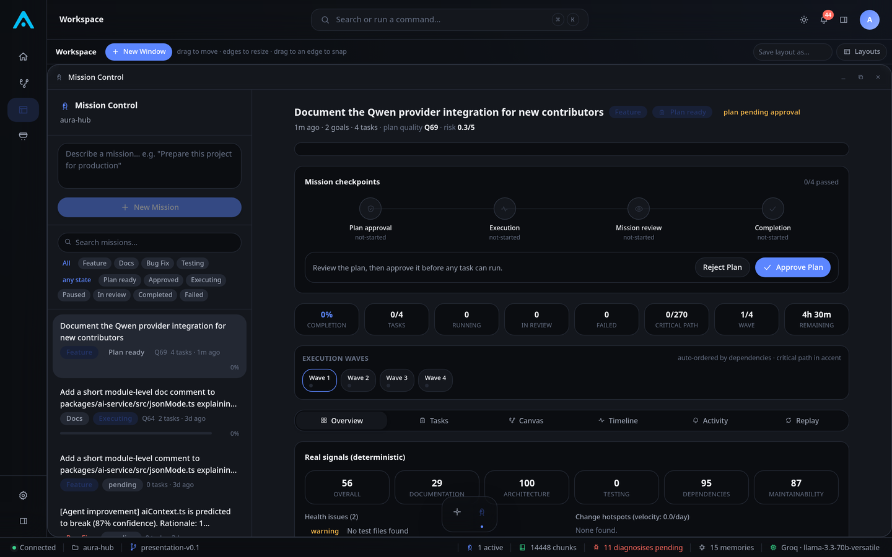 **Mission Control**<br>A real, live-created mission — checkpoints, execution waves, deterministic health signals. |
| 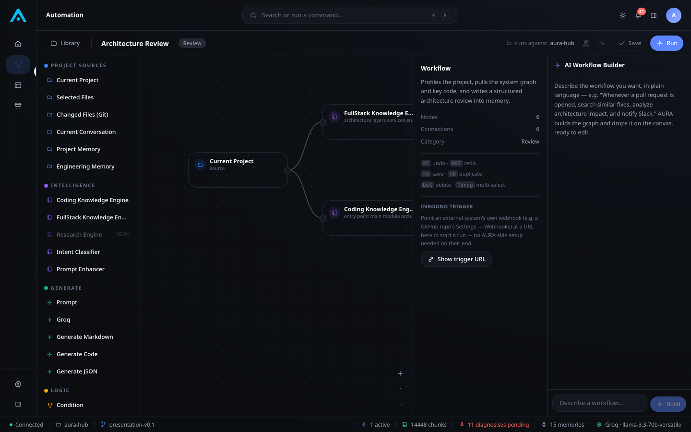 **AI Workflow Builder**<br>Natural language turned into a real, validated automation graph. | 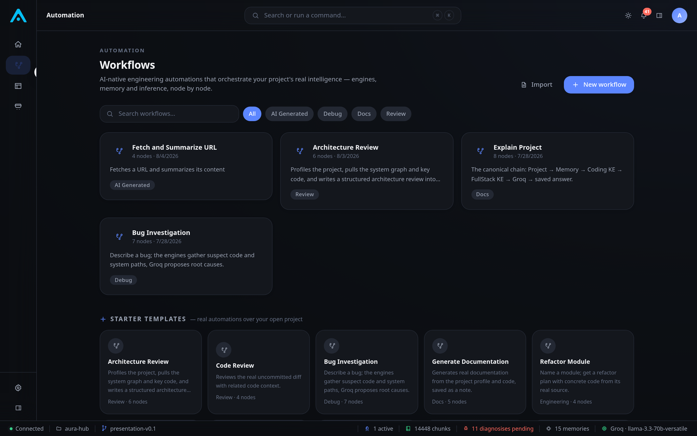 **Automation Studio**<br>The workflow library — real templates with real node/date metadata. |
| 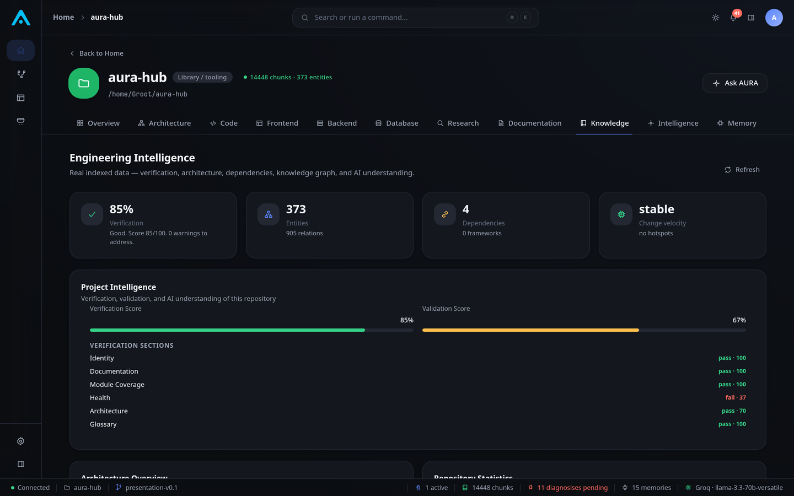 **Knowledge Intelligence**<br>Live verification score, validation score, and repository statistics. | 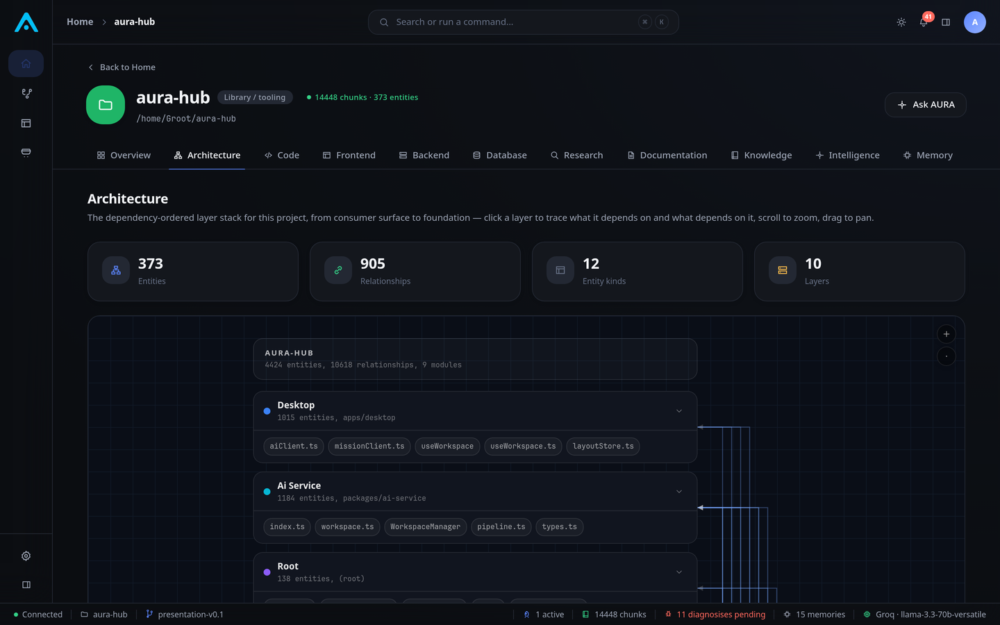 **Architecture Blueprint**<br>Layered module structure and dependency boundaries. |
| 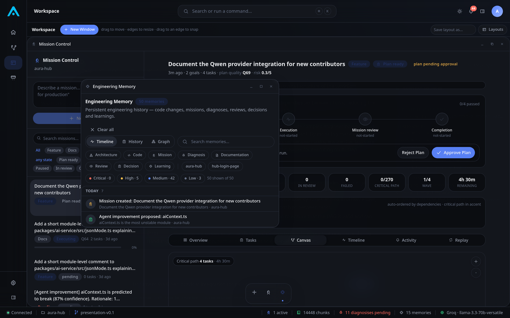 **Engineering Memory**<br>50 real persisted memories — decisions, learnings, agent proposals — filterable by kind and severity. | 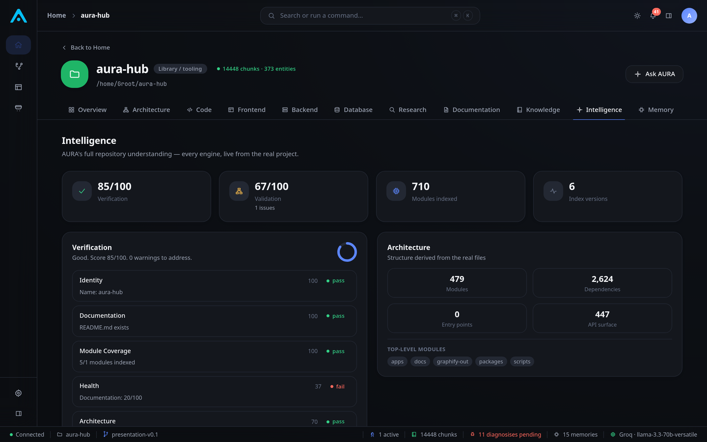 **Engineering Intelligence**<br>Module/dependency/API-surface counts derived from the real repository. |
| 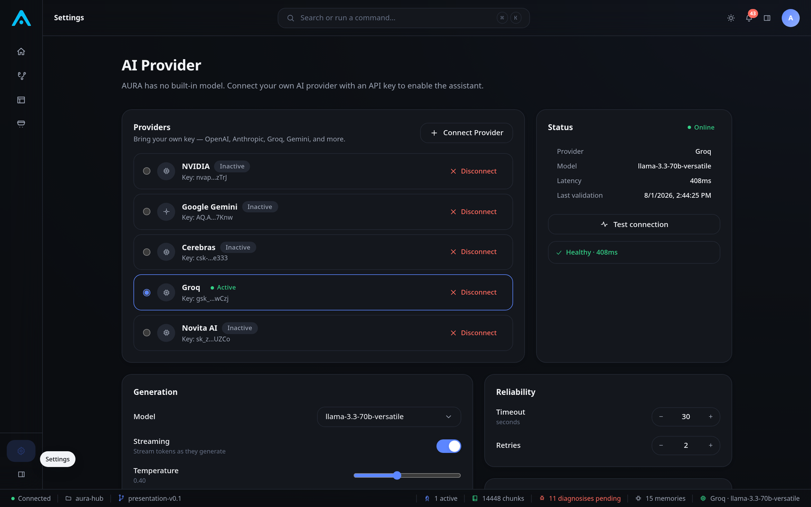 **Multi-Provider AI**<br>Five real BYOAK providers connected, one active, model discovery live. | 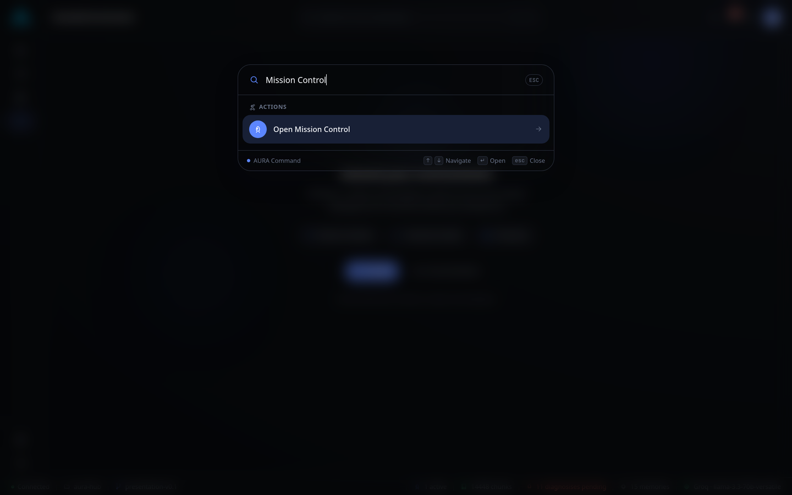 **Command Bar**<br>Keyboard-first navigation across the whole environment. |
| 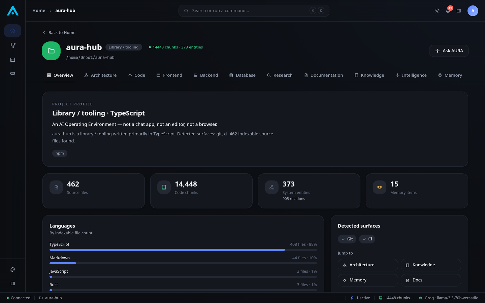 **Project Dashboard**<br>A single project's real indexed stats — files, chunks, entities, languages. | |

## Demo

There's no hosted demo video yet — a full script and shot list for one
is ready to record at
[`docs/DEMO_VIDEO_SCRIPT.md`](docs/DEMO_VIDEO_SCRIPT.md) (2:40, scene-by-
scene, voice-over included). In the meantime, see
[`docs/QWEN_DEMOS.md`](docs/QWEN_DEMOS.md) for five scripted walkthroughs
(AI Chat, Code Generation, Workflow Automation, Engineering Analysis,
Knowledge Graph) you can run yourself against the real app in a few
minutes, and [`examples/`](examples/) for real, importable workflow
templates you can run without writing anything.

## Product Architecture

> One-page executive summary (PDF): [`docs/assets/AURA_HUB_ARCHITECTURE_OVERVIEW.pdf`](docs/assets/AURA_HUB_ARCHITECTURE_OVERVIEW.pdf).

AURA Hub is three layers working as one environment:

- **The desktop application** — the window manager, Mission Control,
  Automation Studio, Knowledge Graph, and Settings all live in one
  native window, never separate tools you switch between.
- **The intelligence layer** — a local, on-device engine that builds
  and maintains your project's knowledge graph, plans and executes
  missions, runs workflows, and remembers engineering decisions across
  sessions.
- **The model layer** — whichever AI provider you connect. AURA has no
  built-in model and never proxies your key through a third party; the
  intelligence layer talks to your chosen provider directly.

Every AI-backed feature shares the same intelligence layer underneath,
so provider validation, error handling, and context assembly are
implemented once and apply everywhere. Full technical architecture,
dependency direction, and extension points for engineers and
contributors: [Development Guide](docs/DEVELOPMENT.md).

<details>
<summary><strong>Every platform, in depth</strong> (click to expand)</summary>

<br>

| Platform | Doc |
|---|---|
| Mission Control v3 (execution engine) | [`docs/architecture/MISSION_CONTROL_V3.md`](docs/architecture/MISSION_CONTROL_V3.md) |
| Provider Integration (BYOAK runtime) | [`docs/architecture/PROVIDER_INTEGRATION.md`](docs/architecture/PROVIDER_INTEGRATION.md) |
| Automation Engine | [`docs/architecture/AUTOMATION_ENGINE.md`](docs/architecture/AUTOMATION_ENGINE.md) |
| Engineering Intelligence Platform | [`docs/architecture/ENGINEERING_INTELLIGENCE_PLATFORM.md`](docs/architecture/ENGINEERING_INTELLIGENCE_PLATFORM.md) |
| Engineering Governance Platform | [`docs/architecture/ENGINEERING_GOVERNANCE_PLATFORM.md`](docs/architecture/ENGINEERING_GOVERNANCE_PLATFORM.md) |
| Predictive Engineering Platform | [`docs/architecture/PREDICTIVE_ENGINEERING.md`](docs/architecture/PREDICTIVE_ENGINEERING.md) |
| Engineering Memory Platform | [`docs/architecture/ENGINEERING_MEMORY_ARCHITECTURE.md`](docs/architecture/ENGINEERING_MEMORY_ARCHITECTURE.md) |
| Engineering Twin | [`docs/architecture/ENGINEERING_TWIN.md`](docs/architecture/ENGINEERING_TWIN.md) |

</details>

## Get AURA Hub

AURA Hub is a native desktop application for **macOS, Windows, and
Linux**, built on Tauri v2. It's in active development — signed,
packaged installers aren't published yet, so today there are two real
ways to get it:

- **Run it from source.** This is the current, working path — see
  [Development](#development) below for the exact commands. It's not a
  "clone a script" affair: you get the full native application, running
  locally, in a few minutes.
- **Check the website** at [aurahub.is-a.dev](https://aurahub.is-a.dev)
  for early access updates as packaged installers become available.

One thing either path needs: an API key from any one of the 11
supported AI providers (see [Core Features](#core-features)). AURA has
no built-in model — nothing AI-related works until you connect one, and
Groq offers a free tier if you don't have a key handy.

## Quick Start

1. **Connect a provider.** Open **Settings → AI Provider**, choose any
   supported provider, and paste your API key. Groq offers a free tier
   if you don't have a key handy. AURA validates the key, discovers its
   available models, and activates it — see
   [`docs/architecture/PROVIDER_INTEGRATION.md`](docs/architecture/PROVIDER_INTEGRATION.md).
2. **Add a project.** From Home, point AURA at a local folder. It's
   indexed by the Coding and FullStack knowledge engines automatically —
   no separate "start indexing" step.
3. **Open the workspace.** Opening a project drops you into its window
   manager — float or dock panels for AI Chat, Files, Architecture, and
   Knowledge as you need them.
4. **Chat with AI.** Ask a real question about the project in **AI
   Chat**. Answers are grounded in the knowledge graph, not just
   whatever's in the prompt.
5. **Create a workflow.** Open the **AI Workflow Builder** and describe
   an automation in plain language — or instantiate one of the 10 real
   templates in the Workflow Library (see [`examples/`](examples/)).
6. **Run it.** Execute the workflow against your open project and watch
   real node-by-node progress on the canvas.

## Roadmap

See [`ROADMAP.md`](ROADMAP.md) for the current Now / Next / Future
direction, and [`docs/ROADMAP.md`](docs/ROADMAP.md) for execution-level
tracking detail. Status legend used throughout this repo: ✅ Implemented
· 🚧 In Progress · 📅 Planned.

## Development

> Everything below is for people building or contributing to AURA Hub
> itself. If you just want to use the app, see
> [Get AURA Hub](#get-aura-hub) and [Quick Start](#quick-start) above.

### Requirements

| Requirement | Version | Needed for |
|---|---|---|
| [Node.js](https://nodejs.org) | ≥ 18.18 | Everything |
| npm | bundled with Node | Workspace installs |
| [Rust](https://www.rust-lang.org/tools/install) | ≥ 1.77.2 | Building the native desktop app (`npm run tauri`) |
| An API key from **any one** supported AI provider | — | AI features. AURA has no built-in model — nothing AI-related works until you connect one. |

**Platform support:** macOS, Windows, and Linux via Tauri v2
(`bundle.targets: "all"` in `apps/desktop/src-tauri/tauri.conf.json`).
Signed installers are not yet published — see [`ROADMAP.md`](ROADMAP.md).

### Clone & install

```bash
git clone https://github.com/Aura-hub-ai-native-workspace/aura-hub.git
cd aura-hub
npm install   # npm workspaces — one install for the entire monorepo
```

### Run — development

```bash
# native desktop window (requires the Rust toolchain) — this is the real app
npm run tauri dev

# browser-only shell, for fast UI iteration without Rust
npm run dev               # → http://localhost:1420

# the local AI service (provider adapters, pipeline, workflow engine)
npm run ai                 # → http://127.0.0.1:4319
```

> The interface is identical in both modes — Vite serves the React
> environment, and Tauri hosts that same build in a native window.
> `npm run dev` is a development convenience for iterating on the UI
> without the Rust toolchain, not a second product; `npm run tauri dev`
> is how AURA Hub actually runs.

### Run — production

```bash
npm run build        # type-check + production build
npm run tauri build  # package native installers (needs Rust + platform build tools)
```

Other scripts:

```bash
npm run typecheck   # project-wide TypeScript build, no emit
npm run clean        # remove node_modules and dist across the workspace
```

### Folder Structure

```
aura-hub/
├─ .github/                    # CODEOWNERS, issue/PR templates, CI workflow
├─ docs/                       # architecture, design, governance, screenshots
│  ├─ architecture/            # deep-dive docs per platform (Mission Control, Providers, Governance, …)
│  └─ assets/                  # brand assets, screenshot gallery spec
├─ examples/                   # real, importable workflow examples (see examples/README.md)
├─ scripts/                    # dev tooling (TS runner, verification scripts, presentation build)
├─ website/                    # the marketing site (website/README.md for deploy instructions)
├─ apps/
│  └─ desktop/                 # the environment app (React + Vite + Tauri)
│     ├─ src/
│     │  ├─ shell/             # AppShell, LeftNav, CommandBar, RightPanel, StatusBar
│     │  ├─ ops/                # window manager, floating panels, agent/memory/notification centers
│     │  ├─ screens/            # Home, project workspace, missions, workflows, governance
│     │  └─ styles/             # global theme layer (CSS variables)
│     └─ src-tauri/             # native desktop wrapper (Rust)
└─ packages/
   ├─ core/                    # tokens · motion · types · global store · navigation model
   ├─ ui/                      # the AURA design system
   ├─ ai-service/               # provider adapters, pipeline, workflow engine, mission control, HTTP+SSE server
   ├─ automation/                # event-driven automation engine (rules, triggers, action chains)
   ├─ governance/                # engineering governance platform (health, drift, debt, release readiness)
   ├─ predictive/                # predictive engineering (deterministic risk/prediction engines)
   ├─ engineering-memory/        # persistent engineering memory platform
   ├─ intelligence/              # intent classification, prompt enhancement pipeline
   ├─ retrieval/                 # chunking, embeddings, ranking, context assembly interfaces
   ├─ knowledge-coding/          # AST-based code indexing and search
   ├─ knowledge-fullstack/       # full-stack entity/relationship extraction, system graph
   └─ runtime/                   # shared provider-neutral runtime contract
```

Workspace packages are consumed **as source** (via Vite/TS path
aliases) — editing any package hot-reloads instantly, no per-package
build step.

## Contributing

AURA is a **Maintainer-Driven Development** project — every change goes
through a Pull Request and requires CODEOWNERS approval before merging
into `main`. No direct pushes, no exceptions.

| | |
|---|---|
| **Commit format** | [Conventional Commits](https://www.conventionalcommits.org/) — `feat(scope): summary`, `fix(scope): summary`, etc. |
| **Branch naming** | `feature/...`, `bugfix/...`, `hotfix/...`, `docs/...`, `refactor/...` — see [`CONTRIBUTING.md`](CONTRIBUTING.md#branch-naming) |
| **Code style** | [`docs/CODE_STYLE.md`](docs/CODE_STYLE.md) |
| **Review process** | PR → CODEOWNERS review → all conversations resolved → owner merges. See [`docs/BRANCH_PROTECTION.md`](docs/BRANCH_PROTECTION.md) for the exact `main` protection rules. |

Start here: [`CONTRIBUTING.md`](CONTRIBUTING.md) ·
[`docs/TEAM_GUIDE.md`](docs/TEAM_GUIDE.md) ·
[`CODE_OF_CONDUCT.md`](CODE_OF_CONDUCT.md) ·
[`SUPPORT.md`](SUPPORT.md)

## Security

Found a vulnerability? Please don't open a public issue — see
[`SECURITY.md`](SECURITY.md) for how to report it responsibly.

## Release Notes

See [`CHANGELOG.md`](CHANGELOG.md) for what's shipped on this branch,
release by release.

## License

Licensed under the [Apache License, Version 2.0](LICENSE).

## Acknowledgements

AURA Hub is built on the shoulders of [React](https://react.dev),
[Vite](https://vitejs.dev), [Tauri](https://tauri.app),
[Tailwind CSS](https://tailwindcss.com), [Framer Motion](https://www.framer.com/motion/),
[Zustand](https://github.com/pmndrs/zustand), and [Monaco Editor](https://microsoft.github.io/monaco-editor/)
— and on every AI provider whose API it integrates with as a first-class,
validated citizen rather than an afterthought.

Governance model inspired by the Pull-Request-first, CODEOWNERS-enforced
patterns used by Kubernetes, VS Code, and React.
